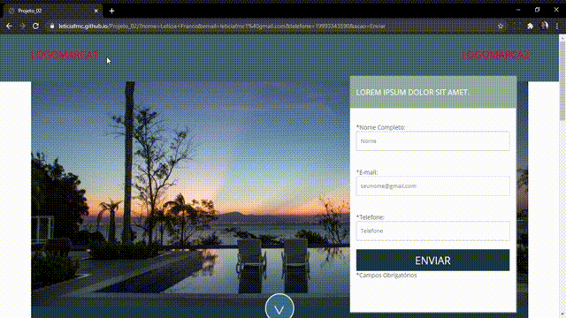

### Página Para Hotéis

O projeto Página Para Hoteis foi meu segundo projeto desenvolvido com HTML5 assim já com as validações do HTML5. Foi utilizado também CSS3 com o objetivo de demostrar meu aprendizado.

### Características

Esta Landing Page apresenta um formato clean com um exemplo de um hotel, é adaptada em todas as telas.

### Instalação

Clone este repositório usando git clone https://github.com/Leticiafrnc/Projeto_02.git ou clique em Code/Download ZIP. Clique no arquivo "index.HTML" e veja a aplicação. Na sessão "About" você tem um link para ter acesso a aplicação também.

### Observação: Se abrir a aplicação no celular, tablet ou qualquer tipo de tela a aplicação se adapta.
